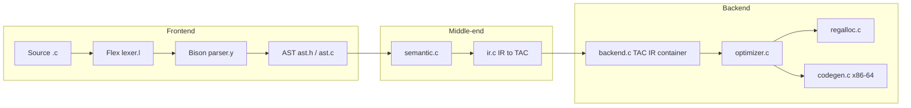

# MiniC Compiler — Frontend, Middle-End, and Backend

**Compiler name:** **MiniC**  
**Implementation language:** C  
**Front-end tools:** **Flex** (`lexer.l`) + **Bison** (`parser.y`)  
**Artifacts:** Abstract Syntax Tree → semantic analysis → Three-Address Code (TAC) IR → optimization → x86-64 assembly (Linux / GNU toolchain)

This document maps **source files → responsibilities → data structures → pipeline**, aligned with the codebase in this repository.

---

## End-to-end compilation pipeline

The driver `main.c` orchestrates:

1. **Parse** (`yyparse`) → builds `ast_root`.
2. **Semantic analysis** (`semantic_analyze(ast_root)`).
3. **IR generation** (`ir_generate`), which fills the global structured program `ir_tac_program` (declared in `ir.h`).
4. **Optimization** (`tac_optimize`) on that structured TAC.
5. **Printing / codegen** (`tac_print`, `tac_codegen_x86`) depending on flags.

**Note:** `regalloc.c` implements liveness / linear-scan scaffolding; `codegen.c` lowers TAC using an explicit **stack-slot model** for locals/temps and SysV argument registers for calls. Register allocation is **infrastructure** that may be integrated more tightly in future revisions.

---

# Part A — Frontend (Lexical + Syntax + AST)

The frontend turns **text** into an **AST** (`ASTNode`) that downstream passes walk.

## A.1 Lexical analysis (`lexer.l`)

**Role:** Tokenize the input: keywords, identifiers, literals, operators, punctuation; maintain **line** and **column** for diagnostics; skip comments and unsupported preprocessor lines.

**Implementation highlights:**

- **Flex:** `noyywrap`; `line_num` / `col_num` updated via `UPDATE_COL` / `RESET_COL` while scanning.
- **Comments:** `//` to end of line; `/* … */` scanned until closing `*/` (updates line on `\n`).
- **Preprocessor:** Lines matching `^[ \t]*"#"[^\n]*` are skipped.
- **Keywords** map to token codes (`KW_INT`, `KW_IF`, …). `true` / `false` → `BOOL_LITERAL` with `yylval.ival`.
- **`printf` / `scanf`:** `KW_PRINTF`, `KW_SCANF` with `strdup(yytext)` in `yylval.sval`.
- **Literals:** decimal / hex / octal ints; floats; char; strings (`strdup` of lexeme including quotes).
- **Operators:** Full C-style set (compound assignments, bitwise, ternary punctuation, `++`/`--`).
- **Errors:** `lex_error()` prints `[Lexer Error] Line … Col …`.

**Interface to Bison:** token codes from `parser.tab.h`; semantic values through the `%union` in `parser.y`.

## A.2 Syntax analysis (`parser.y`)

**Role:** Grammar for the MiniC subset; builds the AST via constructors from `ast.c`.

**Grammar engineering:**

- **`%union`:** `ival`, `fval`, `cval`, `sval`, `ASTNode*`, `NodeList*`.
- **Precedence:** Encodes C’s expression tower; `UNARY_PREC` distinguishes unary vs binary `-`.
- **Dangling else:** `%expect 1` — one S/R conflict, classic resolution.
- **Coverage:** `translation_unit`, declarations, `struct`, statements, full expression hierarchy.

**Errors:** `yyerror` uses `line_num` and `col_num` from the lexer.

## A.3 Abstract Syntax Tree (`ast.h` / `ast.c`)

**Role:** Single in-memory program representation for semantic analysis and IR generation.

**Design:**

- **`NodeKind`:** program, declarations, statements, expressions, literals.
- **`ASTNode`:** `kind`, `line`, and a **union** of node payloads (`program`, `func_def`, `binop`, `call`, …).
- **`NodeList`:** growable array for lists of nodes.
- **Memory:** strings via `strdup`; `ast_free()` recursively frees the tree.

**Contract:** Semantic analysis and `ir.c` consume `ast_root`. The backend works from TAC, not the AST directly.

---

# Part B — Middle-end (Semantic analysis + IR / TAC)

Validates **meaning** (types, scopes) and lowers valid programs into **TAC** stored as `TACProgram*` in `ir_tac_program` (`ir.c`).

## B.1 Semantic analysis (`semantic.c`)

**Entry:** `int semantic_analyze(ASTNode *root)` (`semantic.h`).

**Internal model (implementation detail):**

- **`TypeKind`:** `void`, `bool`, `char`, `int`, `float`, `string`, `struct`, `array`, `function`, `invalid`.
- **`Type`:** arrays → `base` + `arr_size`; functions → `ret`, `params`, `param_count`; structs → name.
- **`Scope`:** linked list of symbols + **parent** pointer → nested scopes.
- **`Symbol`:** name, `Type*`, line.
- **`StructDef`:** struct name + member scope.
- **`SemCtx`:** scope chain, struct list, **current return type**, **loop depth** (`break`/`continue`), error count.

**Checks (patterns in source):**

- **`scope_lookup`** walks to root.
- **`can_assign`:** compatible types; rejects invalid assignment targets.
- **Structs** recorded and used for member access typing.
- **`sem_error`:** `[Semantic Error] Line …`

Non-zero errors cause the driver to stop before IR.

## B.2 Intermediate representation (`ir.c` + `backend.h`)

**Entry:** `void ir_generate(ASTNode *root, FILE *out)` (`ir.h`).

**Dual output:**

1. **Textual IR stream** to `out` via `emit()` (for `--emit-ir` / debugging).
2. **Structured TAC** in `ir_tac_program` via `emit_tac_instr()`, `tac_program_add_func()`, `tac_func_add_instr`.

**`IRGen` state:** `temp_id`, `label_id` (`t0`, `L0`, …); `current_func` while lowering a function.

**`gen_expr`:**

- Literals and operations become temporaries and `TAC_BINOP` / assignments.
- **`gen_call`:** emits `TAC_PARAM` per argument, then `TAC_CALL` with **callee in `instr->attr`**, **arg count in `attr_int`**, **result temp in `dest`**.
- Assignments / compound ops use `TAC_ASSIGN` / `TAC_BINOP` on lvalues.

**`gen_stmt`:** variables (`TAC_VAR`), returns (`TAC_RETURN`), compound statements, control flow (textual labels in the IR stream for some constructs; structured jumps may be partial depending on construct—optimizer/codegen rely on what is inserted into `TACFunc`).

**`operand_from_text`:** distinguishes temps, bools, quoted strings, chars, ints, floats, else `OPERAND_VAR`.

**Globals:** top-level vars/arrays may add `TAC_VAR` via `tac_program_add_global`.

---

# Part C — Backend (TAC container, optimization, machine code)

## C.1 TAC representation (`backend.c` / `backend.h`)

- **`TACOpKind`:** assignments, binary/unary ops, arrays, `TAC_PARAM`, `TAC_CALL`, labels, jumps, `TAC_RETURN`, …
- **`OperandKind`:** constants, `TEMP`, `VAR`, `LABEL`, `STRING`.
- **`TACInstr`:** `dest`, `left`, `right`; **`attr`** (operator or **callee name**); **`attr_int`** (array size, arg count, …).
- **`TACFunc` / `TACProgram`:** functions + optional global `TACInstr` list.

Passes may **rewrite** instructions in place.

## C.2 Optimization (`optimizer.c`)

**Entry:** `tac_optimize(TACProgram*)` (`OptPassKind` in `backend.h`).

1. **Constant folding:** `TAC_BINOP` with constant operands → `TAC_ASSIGN_CONST` when possible; logs `[CONST_FOLD]` to stderr.
2. **Dead code elimination:** removes unused assignments where safe.
3. **Common subexpression elimination:** reuses identical `TAC_BINOP` results; logs `[CSE]`.

## C.3 Register allocation (`regalloc.c`)

Liveness / linear-scan toward x86 registers (`eax`, `ecx`, …). Codegen currently uses **stack slots** for most operands; this module is ready for tighter integration.

## C.4 Code generation (`codegen.c`)

**Entry:** `void tac_codegen_x86(TACProgram *prog, FILE *out)`.

- **Per-function** slot table for `VAR`/`TEMP` → `-%d(%rbp)`.
- **Prologue/epilogue:** standard frame; function-local return label (e.g. `.L_return_main`).
- **ALU:** 32-bit AT&T (`movl`, `addl`, `cmpl`, `idivl` / `cltd`, compare + `set*` for relations).
- **Calls:** buffer `TAC_PARAM`, then load args into SysV order (`%edi`, `%esi`, …); **`call`** uses **`instr->attr`** as the symbol; **`printf`:** `movl $0, %eax` before `call`.
- **Strings:** `.rodata` with `.LC0`, …; `leaq …(%rip)` for pointer args.
- **Driver:** With `--codegen -o out.s`, `main.c` can write **pure asm** to `out.s` and **TAC report** to `out.s.log` for direct `gcc` assembly.

---

## Layer summary

| Layer        | Inputs        | Outputs                         | Main files                          |
|-------------|---------------|----------------------------------|-------------------------------------|
| **Frontend**| `.c` source   | `ASTNode *ast_root`              | `lexer.l`, `parser.y`, `ast.h`, `ast.c` |
| **Middle**  | AST           | `TACProgram *ir_tac_program`     | `semantic.c`, `ir.c`, `backend.h`    |
| **Backend** | `TACProgram`  | Optimized TAC + x86-64 `.s`      | `backend.c`, `optimizer.c`, `regalloc.c`, `codegen.c` |

---

## Typical commands

| Stage        | Command |
|-------------|---------|
| Lexer only  | `./build/minic --tokens path.c` |
| Parser/AST  | `./build/minic --ast path.c` |
| TAC         | `./build/minic path.c` ; `./build/minic --no-opt path.c` |
| IR text     | `./build/minic --emit-ir path.c` (when enabled) |
| Assembly    | `./build/minic --codegen path.c` ; `./build/minic --codegen -o out.s path.c` then `gcc -no-pie out.s -o out` |
